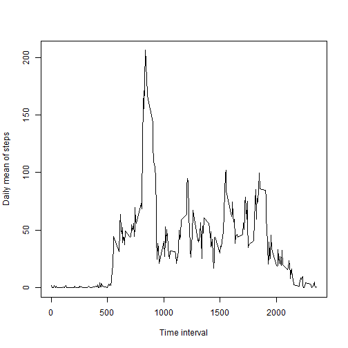
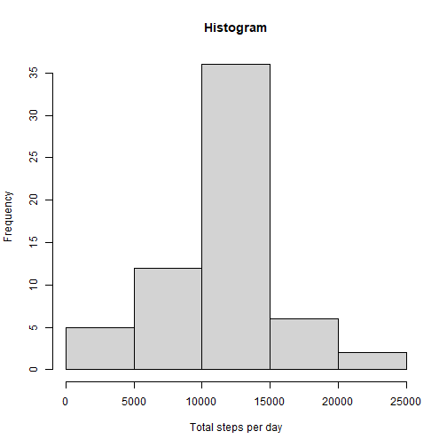
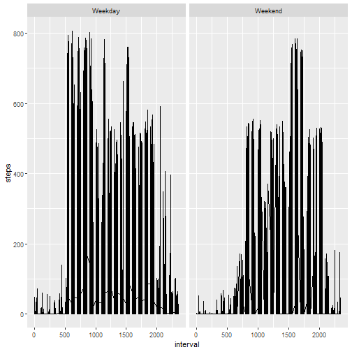

## Introduction

This assignments includes data from a personal activity monitoring device, which collects data at 5 minute intervals through out the day. The data consists of two months of data from an anonymous individual collected during the months of October and November, 2012 and include the number of steps taken in 5 minute intervals each day.
Firstly, the dataset is loaded into R. 


``` r
# Load dataset

    activity <- read.csv("activity.csv")
    activity$date <- as.Date(activity$date)

# Load libraries
    
    library(tidyverse)
```

```
## ── Attaching core tidyverse packages ────────────────────────────────────────────────────────────── tidyverse 2.0.0 ──
## ✔ dplyr     1.1.4     ✔ readr     2.1.5
## ✔ forcats   1.0.0     ✔ stringr   1.5.1
## ✔ ggplot2   3.5.1     ✔ tibble    3.2.1
## ✔ lubridate 1.9.3     ✔ tidyr     1.3.1
## ✔ purrr     1.0.2     
## ── Conflicts ──────────────────────────────────────────────────────────────────────────────── tidyverse_conflicts() ──
## ✖ dplyr::filter() masks stats::filter()
## ✖ dplyr::lag()    masks stats::lag()
## ℹ Use the conflicted package (<http://conflicted.r-lib.org/>) to force all conflicts to become errors
```

``` r
    library(dplyr)
    library(ggplot2)
```

<br>

In the following, several research questions are answered:

<br>

#### 1. What is mean total number of steps taken per day?

The histogram illustrates the total number of steps taken per day.


``` r
# Calculate total number of steps per day

    steps_per_day <- aggregate(steps ~ date, 
                               data = activity, 
                               FUN = sum,
                               na.rm = TRUE)

# Produce histogram of total number of steps per day

    hist(steps_per_day$steps, 
         main = "Histogram", 
         xlab = "Total steps per day", 
         ylab = "Frequency")
```

[plot of chunk steps per day](figure/steps per day-1.png)


Mean and median of total number of steps per day:


``` r
# Calculate and report mean and median of total number of steps per day

    mittelwert <- mean(steps_per_day$steps)
    medianwert <- median(steps_per_day$steps)
    
    ergebnis <- merge(mittelwert, medianwert)
    colnames(ergebnis) <- c("Mean", "Median")
    
    print(ergebnis)
```

```
##       Mean Median
## 1 10766.19  10765
```

<br>

#### 2. What is the average daily activity pattern?

The following plot shows the mean number of daily steps per time interval.


``` r
# Calculate mean number of daily steps per time interval

    steps_per_interval <- aggregate(steps ~ interval, 
                                  data = activity, 
                                  FUN = mean, 
                                  na.rm = TRUE)

# Plot mean number of daily steps per time interval

    plot(steps_per_interval$interval, steps_per_interval$steps, 
         type = "l",
         xlab = "Time interval",
         ylab = "Daily mean of steps")
```




The maximum number of steps took place in the following 5-minute interval:


``` r
# Which 5-minute interval, on average across all the days in the dataset, contains the maximum number of steps?

    subset(steps_per_interval, steps == max(steps, na.rm = TRUE))$interval
```

```
## [1] 835
```

<br>

#### 3. Imputing missing values

As there are missing values in the data set, these can be imputed statistically. In a first step, the number of missing values in the data set is calculated.


``` r
# Number of missing values in the data set

    sum(is.na(activity))
```

```
## [1] 2304
```

``` r
# Impute NA-data with mean of interval

    activity_imputed <- activity %>%
          group_by(interval) %>%
          mutate(steps = ifelse(is.na(steps),
          mean (steps, na.rm = TRUE), steps))
```


In the following histogram, the total number of steps taken per day are illustrated for the imputed data. 


``` r
# Histogramm for steps per day for imputed data

    steps_per_day_imp <- aggregate(steps ~ date, 
                               data = activity_imputed, 
                               FUN = sum,
                               na.rm = TRUE)
    
    hist(steps_per_day_imp$steps, 
         main = "Histogram", 
         xlab = "Total steps per day", 
         ylab = "Frequency")
```



Values for mean and median of total number of steps per day are converging in the imputed data set:


``` r
# calculate and report mean and median of total number of steps per day for imputed data

    mittelwert <- mean(steps_per_day_imp$steps)
    medianwert <- median(steps_per_day_imp$steps)
    
    ergebnis_imp <- merge(mittelwert, medianwert)
    colnames(ergebnis_imp) <- c("Mean", "Median")
    
    print(ergebnis_imp)
```

```
##       Mean   Median
## 1 10766.19 10766.19
```

<br>

#### 4. Are there differences in activity patterns between weekdays and weekends?

The different activity patterns for weekdays and weekends is illustrated in the following plots.


``` r
# Identify and mark weekdays in the data set    

    activity_imputed$weekday <- weekdays(activity_imputed$date)
    
    activity_imputed$weekday_bi <- activity_imputed$weekday == "Samstag" |
      activity_imputed$weekday == "Sonntag"
    
    activity_imputed$weekday_binom <- as.numeric(activity_imputed$weekday_bi)
    
# Create plots for weekday vs. weekend
    
    g <- ggplot(activity_imputed, aes(interval, steps))
    
    g + geom_line() + facet_grid(. ~ weekday_binom, 
                                labeller = labeller(weekday_binom = c("0" = "Weekday",
                                                                      "1" = "Weekend")), 
                                margins = FALSE)
```


